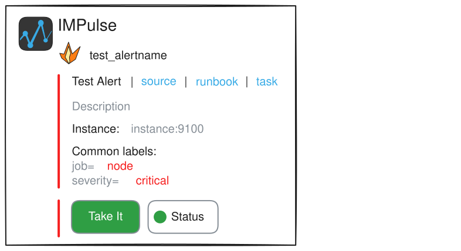

<h1> IMPulse</h1>

**An open-source, self-hosted incident management platform built around ChatOps and configuration as code.**

IMPulse helps SRE, DevOps, and platform teams route alerts, escalate incidents, coordinate responders, and manage incident workflows without introducing a heavy operational stack. It integrates with Alertmanager and Grafana, works directly in Slack, Mattermost, Telegram, or its built-in web UI, and keeps response logic under your control.

[](https://impulse.bot)
[](https://docs.impulse.bot/stable/)
[](https://github.com/eslupmi/impulse/pkgs/container/impulse)
[](https://artifacthub.io/packages/helm/impulse/impulse)
[](LICENSE.md)


## Why IMPulse

Incident management platforms often grow into large control planes with their own databases, queues, service catalogs, user models, and operational dependencies.

IMPulse takes a different approach: start with the parts teams need most — alert routing, escalation, incident coordination, maintenance workflows, and ChatOps — while keeping deployment lightweight and response policy versionable as code.

- **ChatOps-first incident response.** In a messenger, each incident becomes a message and its lifecycle stays in the thread. Responders can take, release, assign, freeze, and create Jira tasks directly from incident controls.
- **Configuration as code.** Recursive routes, escalation chains, schedules, inhibition rules, webhooks, and Jinja templates can be defined in `impulse.yml`, reviewed, and versioned alongside the rest of your infrastructure.
- **Lightweight self-hosting.** The default deployment is one application service with mounted configuration and data directories. There is no separate database server, message broker, or cache to provision.
- **Flexible escalation workflows.** Escalation policies — called chains in configuration — can notify users and groups, wait between steps, call webhooks, nest other policies, follow schedules, use Google Calendar, or use shifts managed in the web UI.
- **Integrates with your existing stack.** Keep Alertmanager or Grafana as your alert source and Slack, Mattermost, or Telegram as your response workspace instead of replacing everything at once.

IMPulse is designed to grow with your incident-management workflow while preserving a lightweight, automation-friendly architecture.




## Core capabilities


| Area                    | What IMPulse provides                                                                                                                                                                                    |
| ----------------------- | -------------------------------------------------------------------------------------------------------------------------------------------------------------------------------------------------------- |
| Alert intake            | Alertmanager-compatible webhooks and Grafana contact points                                                                                                                                              |
| Routing                 | Recursive, Alertmanager-style matcher rules that select a channel and escalation chain                                                                                                                   |
| Escalation & scheduling | Simple, nested, scheduled, Google Calendar-backed, and UI-managed chains with user, group, wait, nested-policy, and webhook steps                                                                        |
| Incident response       | Assignment, take/release controls, manual freeze, matcher-based inhibition, maintenance windows, and Jira task creation                                                                                  |
| Collaboration           | Slack, Mattermost, Telegram, thread notifications, Slack/Mattermost user groups, and customizable Jinja message templates                                                                                |
| Incident lifecycle      | `firing`, `resolved`, `unknown`, and `closed` states with configurable lifecycle timeouts and historical retention                                                                                       |
| Incident visibility     | Real-time web UI with configurable columns, filters, sorting, highlighting, incident details, and historical incidents                                                                                   |
| Operations              | One-service deployment, local persistent state, configuration validation on startup and reload, REST API with OpenAPI documentation, Prometheus metrics, health endpoints, and primary/standby operation |


Explore the [incident lifecycle](https://docs.impulse.bot/stable/concepts/incident/), [configuration reference](https://docs.impulse.bot/stable/config_file/), and [API and service endpoints](https://docs.impulse.bot/stable/concepts/api/) for the complete behavior.

## Integrations


| Purpose               | Supported integrations                                                                                                                                                                                                                    |
| --------------------- | ----------------------------------------------------------------------------------------------------------------------------------------------------------------------------------------------------------------------------------------- |
| Alert sources         | [Alertmanager](https://docs.impulse.bot/stable/alertmanager/), [Grafana](https://docs.impulse.bot/stable/grafana/)                                                                                                                        |
| Messengers            | [Slack](https://docs.impulse.bot/stable/integrations/messengers/slack/), [Mattermost](https://docs.impulse.bot/stable/integrations/messengers/mattermost/), [Telegram](https://docs.impulse.bot/stable/integrations/messengers/telegram/) |
| Escalation scheduling | [Google Calendar](https://docs.impulse.bot/stable/integrations/calendars/google/)                                                                                                                                                         |
| Task management       | [Jira](https://docs.impulse.bot/stable/integrations/task_management/jira/)                                                                                                                                                                |
| Outbound automation   | Templated HTTP webhooks, with examples for Instatus, Twilio, Zvonok, and custom integrations                                                                                                                                              |


## Quick start

This path starts the latest tagged release with Docker Compose and the built-in web UI, without connecting a messenger.

### Prerequisites

- Git
- Docker with the Compose plugin


### 1. Prepare the release

```bash
git clone https://github.com/eslupmi/impulse.git
cd impulse

release_tag="$(git tag --sort=-v:refname | head -n 1)"
git checkout --detach "$release_tag"

mkdir -p runtime/config runtime/data
cp examples/docker-compose.yml runtime/docker-compose.yml
cp examples/impulse.none.yml runtime/config/impulse.yml
sed -i "s|<release_tag>|$release_tag|" runtime/docker-compose.yml
```


### 2. Start IMPulse

```bash
cd runtime
docker compose up -d
```

Open [http://localhost:5000/](http://localhost:5000/). The online indicator in the UI confirms that IMPulse is running and receiving live updates.

### 3. Send a test alert

```bash
curl --fail-with-body \
  --header 'Content-Type: application/json' \
  --data '{
    "version": "4",
    "groupKey": "InstanceDown-node",
    "status": "firing",
    "receiver": "webhook-alerts",
    "groupLabels": {
      "alertname": "InstanceDown"
    },
    "commonLabels": {
      "alertname": "InstanceDown",
      "severity": "warning"
    },
    "commonAnnotations": {
      "summary": "A node exporter instance is unavailable"
    },
    "alerts": [
      {
        "status": "firing",
        "labels": {
          "alertname": "InstanceDown",
          "severity": "warning",
          "instance": "localhost:9100"
        },
        "annotations": {
          "summary": "A node exporter instance is unavailable"
        },
        "startsAt": "2024-07-28T19:26:43.604Z",
        "endsAt": "0001-01-01T00:00:00Z"
      }
    ]
  }' \
  http://localhost:5000/
```

The new `firing` incident appears in the UI.

Follow the [installation guide](https://docs.impulse.bot/stable/installation/) for production deployment or start from the [Slack configuration example](examples/impulse.slack.yml) to connect a messenger and route real alerts.

## Configuration and deployment

IMPulse uses a single `impulse.yml` configuration file for its primary declarative configuration. The main sections define:

- messenger users, groups, channels, escalation chains, and templates;
- incident notifications, lifecycle timeouts, and retention;
- recursive routes and Alertmanager-style matchers;
- inhibition rules and external webhooks;
- Jira task management; and
- web UI columns, filters, sorting, and colors.

Some runtime-managed data, including maintenance windows and UI-managed schedules, is stored separately under the configured data path.

IMPulse validates `impulse.yml` at startup and will not start with invalid configuration. A failed reload leaves the currently valid configuration running. Configuration can be reloaded with a `HUP` signal or the `/-/reload` endpoint. See [check and reload](https://docs.impulse.bot/stable/concepts/check/) for details.

For production deployments, review:

- [environment variables](https://docs.impulse.bot/stable/envs/) for listen addresses, data/config paths, proxy settings, and credentials;
- [high availability](https://docs.impulse.bot/stable/concepts/ha/) for primary/standby behavior and readiness routing;
- [`/livez`](https://docs.impulse.bot/stable/concepts/api/), [`/readyz`](https://docs.impulse.bot/stable/concepts/api/), and [`/metrics`](https://docs.impulse.bot/stable/concepts/api/) for health checks and monitoring; and
- [versioning and upgrades](https://docs.impulse.bot/stable/versioning/) before changing major versions.


## Documentation and support

- [Documentation](https://docs.impulse.bot/stable/)
- [Changelog](CHANGELOG.md)
- [GitHub Discussions](https://github.com/orgs/eslupmi/discussions)
- [Issue tracker](https://github.com/eslupmi/impulse/issues)
- [support@impulse.bot](mailto:support@impulse.bot)


## License

IMPulse is licensed under the [GNU General Public License v3.0](LICENSE.md).
