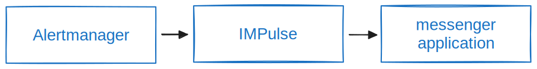

# Concepts

IMPulse is installed between alert source and a messenger.

!!! info
    For example, let's take Alertmanager as the alert source.

IMPulse receives alerts from Alertmanager and sends them to your messenger channel based on `messenger` and `route` configuration (see [Configuration File](config_file.md)).

Alertmanager sends alerts with one of two statuses: **firing** and **resolved**. The first status is always **firing** when a problem occurs. Based on these statuses, IMPulse creates Incidents.

## Incident

An incident is a messege representation of an alert with its current status.

### Structure

Starting from [`v1.0.0`](https://github.com/DiTsi/impulse/releases/tag/v1.0.0) incident messages have the following structure:

Default templates for `status icons`, `header` and `body` are [here](https://github.com/DiTsi/impulse/tree/develop/templates).

You can create your own template files based on defaults and set their path in [messenger.template_files](config_file.md).

### Statuses and their colors

Unlike Alertmanager alerts, IMPulse Incidents can have four statuses: **firing**, **resolved**, **unknown**, **closed**.

#### firing and resolved

 

Incident status changes to **firing** and **resolved** based on Alertmanager's alert statuses received by IMPulse.

#### unknown

IMPulse introduces an additional status called **unknown** to indicate that the current status of the incident may be outdated.

Alertmanager uses `repeat_interval` and `group_interval`to periodically resend the current alert status, even if it hasn't changed.

IMPulse has a setting [`incident.timeouts.firing`](config_file.md) which defines how long it should wait for an update from Alertmanager.
For this you should set Alertmanager's `repeat_interval` + `group_interval` a little bit more than [`incident.timeouts.firing`](config_file.md).

If an Incident status isn't updated within `incident.timeouts.firing` it switches to non-actual status named **unknown**.

Possible causes of **unknown** status:

- IMPulse did not receive an updated alert status (e.g., IMPulse or Alertmanager was down, or there were network issues)
- `repeat_interval` + `group_interval` exceeds IMPulse's `incident.timeouts.firing`

When an incident becomes **unknown** , IMPulse sends a warning message to `messenger.admin_users`.

#### closed

The **closed** status means the incident is closed and retained only for history and statistics. The retention period for a closed incident file is configured via `incident.timeouts.closed`. You can see closed incidents in the UI by clicking the [archive button](ui.md#elements).

There are two ways an Incident can be closed:
- a **resolved** incident remains in that status for the duration of`incident.timeouts.resolved`
- an **unknown** incident remains in that status for the duration of `incident.timeouts.unknown`

### Lifecycle

IMPulse creates an Incident with  the **firing** status and tracks it until its status becomes **closed**.

Here is a visualization of the full incident lifecycle:

Or individually by status:

