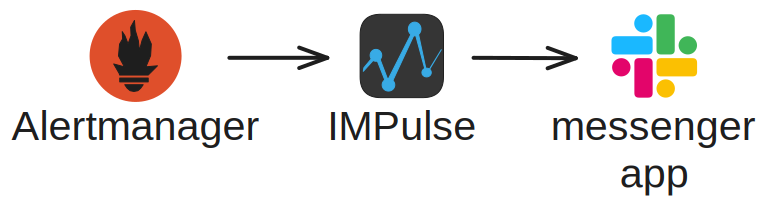
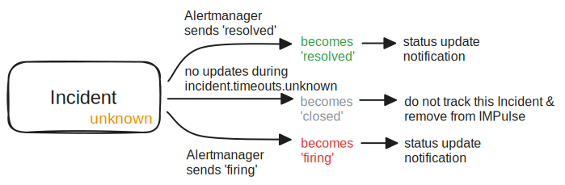
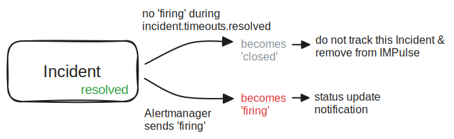

# Concepts

IMPulse is installed between Alertmanager and one of the messengers.

IMPulse gets alerts from Alertmanager and sends them to your messenger's channel based on `application` and `route` configuration (see [Configuration File](config_file.md)).

Alertmanager sends alerts with one of two statuses: **firing** and **resolved**. Of course, first status is always **firing** when problem occurs. Based on these statuses IMPulse creates Incidents.

## Incident

Incident is a messege representation of alert with actual status.

### Structure
Starting from [`v1.0.0`](https://github.com/DiTsi/impulse/releases/tag/v1.0.0) incident messages have such structure:

Default templates for `status icons`, `header` and `body` are [here](https://github.com/DiTsi/impulse/tree/main/templates).

You can create your own template files based on defaults and set their path in [application.template_files](config_file.md).

### Statuses and their colors

Unlike of Alertmanager alerts, IMPulse Incidents may have 4 statuses: **firing**, **resolved**, **unknown**, **closed**.

#### firing and resolved

 

Incident changes status to **firing** and **resolved** based on Alertmanager's alerts statuses are sent to IMPulse.

#### unknown

IMPulse has additional status to determine incident status actuality.

Alertmanager has `repeat_interval` and `group_interval` values which force Alertmanager to send actual alert status even if it didn't change. 

IMPulse has [`incident.timeouts.firing`](config_file.md) option during which the incident status should be updated by Alertamanger.

For this you should set Alertmanager's `repeat_interval` + `group_interval` a little bit more than [`incident.timeouts.firing`](config_file.md).

If Incident status isn't updated during `incident.timeouts.firing` it switches to non-actual status named **unknown**.

The appearence of **unknown** Incident is caused by one of this reasons:

- IMPulse didn't receive actual status from Alertmanager. Maybe IMPulse was down, Alertmanager was down or there are some network problems
- `repeat_interval`+`group_interval` is less than IMPulse's `incident.timeouts.firing`

When Incident becomes **unknown** IMPulse sends warning message to `application.admin_users`.

#### closed

It is an Incident which hasn't already been tracked by IMPulse. 

There are two ways how the Incident can be closed: 
- **resolved** Incident stays in this status for `incident.timeouts.resolved` time
- **unknown** Incidents stays in this status for `incident.timeouts.unknown` time

### Lifecycle

IMPulse creates an Incident with **firing** status and is  tracking it till the Incident status will become **closed**. 

Here you can see the whole lifecycle of an Incident:

Or individually for all statuses:

