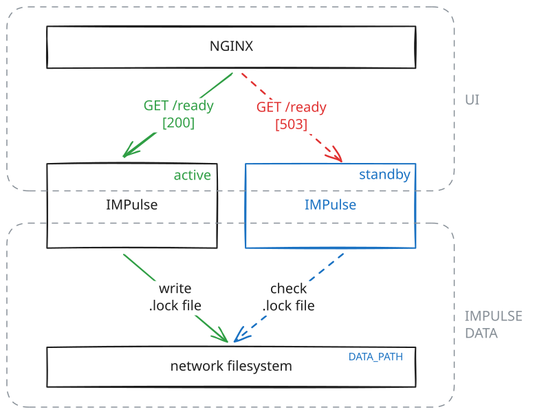

# High Availability

## Two instances

IMPulse allows running multiple instances to ensure high availability.



Instances sharing the same storage elect one **primary**. Other instances start in **standby** mode and wait until the primary shuts down or its lock expires. All instances must use the same configuration and storage backend.

With `STORAGE_BACKEND=filesystem`, mount the same `DATA_PATH`[↰](../envs.md) on both instances. The lock uses `.lock.d` heartbeat files and a persistent `.lock.guard` file to serialize acquisition, renewal, and release. The filesystem must support shared advisory locks (`flock` on POSIX or byte-range locks on Windows). Keep host clocks synchronized. Do not delete the guard file or mix these instances with older versions that do not use it.

With `STORAGE_BACKEND=s3`, configure the same `S3_BUCKET` and `S3_PREFIX` on both instances. Local `DATA_PATH` directories may differ; a shared filesystem is unnecessary. The lock is the object `<S3_PREFIX>/.lock.d/lease.json`. Atomic conditional writes elect and renew the primary, and conditional deletion prevents an old primary from removing its successor's lease. The endpoint must provide strong consistency and support conditional `PutObject` and `DeleteObject`; see [S3 storage](../envs.md#s3-storage). S3 lock expiry uses server timestamps, so it does not depend on matching client wall clocks.

The primary renews its lock every 6 seconds. After a crash, a standby can take over after approximately 18 seconds without renewal (S3 adds a timestamp rounding margin). Graceful shutdown releases the lock sooner. Before becoming ready, the new primary reloads persisted state and reconstructs its queue.

If ownership is lost or the S3 lease cannot be renewed, the primary becomes unready, rejects new work, cancels queue processing and background tasks, and returns to standby. Storage errors prevent promotion rather than allowing two primaries to proceed.

!!! warning "In-flight operations"
    The lease coordinates primary ownership; it cannot retract a data write or messenger request already sent before ownership was lost. A prolonged process pause or network delay across takeover can leave such operations in flight. This is not an exactly-once delivery guarantee.

Check the `/readyz` endpoint to get the instance state. It responds with `200` if the instance is ready and **primary**, and `503` if the instance is in **standby**.

The `/livez` endpoint is used for liveness checks and always returns `200` if the container is alive, regardless of whether it's in **standby** or **primary** mode. This endpoint is available in both modes and should be used for Kubernetes liveness probes.

When running multiple IMPulse instances, configure your proxy (Nginx or another) to use the `/readyz` endpoint for readiness checks, routing traffic only to the **primary** instance. Use `/livez` for liveness checks to ensure containers are restarted if they become unresponsive. See [API](api.md) for endpoint details.

## Storage failures

Monitor available filesystem space, storage access, and lock renewal errors. A full or unavailable filesystem can prevent persistence and heartbeat renewal; an instance that can no longer prove ownership stops processing. S3 connection, permission, and unsupported conditional-operation errors also keep the instance unready. Restore storage access before expecting promotion or recovery.

## Test S3 locally

The following Bash/WSL walkthrough uses [Moto's local S3 server](https://docs.getmoto.org/en/latest/docs/server_mode.html), two IMPulse processes, and no messenger credentials. Moto 5.2.3 was verified with the conditional operations required by the lease. This checks the emulator; repeat the same failover checks against your intended S3 endpoint before deployment.

With Python 3.10 or newer and virtual environment support installed (`python3-venv` on Debian/Ubuntu), run these commands from the repository root:

```bash
python3 -m venv /tmp/impulse-s3-venv
source /tmp/impulse-s3-venv/bin/activate
python -m pip install -r requirements.txt -r tests.requirements.txt 'moto[server]==5.2.3'
python -m pytest tests/test_storage.py tests/test_s3_stores.py tests/test_s3_lock.py tests/test_file_lock_concurrency.py tests/test_ha_initialization.py tests/test_ha_lifecycle.py -q --no-cov
```

Start the emulator in this terminal and leave it running:

```bash
python -m moto.server -H 127.0.0.1 -p 9000
```

In a second terminal, from the same repository root:

```bash
source /tmp/impulse-s3-venv/bin/activate
test_dir=$(mktemp -d /tmp/impulse-s3-local.XXXXXX)
cat > "$test_dir/impulse.yml" <<'YAML'
messenger:
  type: none
incident:
  timeouts:
    firing: 6h
    unknown: 6h
    resolved: 12h
    closed: 90d
YAML
export CONFIG_PATH="$test_dir" STORAGE_BACKEND=s3
export S3_BUCKET=impulse-local S3_PREFIX=ha-test
export S3_ENDPOINT_URL=http://127.0.0.1:9000
export AWS_ACCESS_KEY_ID=local AWS_SECRET_ACCESS_KEY=local AWS_DEFAULT_REGION=us-east-1
export AWS_EC2_METADATA_DISABLED=true LISTEN_HOST=127.0.0.1 HTTP_PREFIX=''
export NO_PROXY=127.0.0.1,localhost
python - <<'PY'
import os
import boto3

boto3.client('s3', endpoint_url=os.environ['S3_ENDPOINT_URL']).create_bucket(
    Bucket=os.environ['S3_BUCKET'])
PY
python -m main --check
DATA_PATH="$test_dir/one" LISTEN_PORT=5001 python -m main > "$test_dir/one.log" 2>&1 &
first=$!
DATA_PATH="$test_dir/two" LISTEN_PORT=5002 python -m main > "$test_dir/two.log" 2>&1 &
second=$!
printf 'Port 5001 PID: %s; port 5002 PID: %s; logs: %s\n' "$first" "$second" "$test_dir"
```

After startup, check both instances:

```bash
curl -s -o /dev/null -w '5001 ready: %{http_code}\n' http://127.0.0.1:5001/readyz
curl -s -o /dev/null -w '5002 ready: %{http_code}\n' http://127.0.0.1:5002/readyz
```

Exactly one should return `200`; the standby returns `503`. Both `/livez` endpoints should return `200`. Set `primary` to the port returning `200`, then create an incident:

```bash
primary=http://127.0.0.1:5001
curl -sS -H 'Content-Type: application/json' -d '{"version":"4","status":"firing","receiver":"local","groupLabels":{"alertname":"S3LocalTest"},"commonLabels":{"alertname":"S3LocalTest"},"commonAnnotations":{},"alerts":[{"status":"firing","labels":{"alertname":"S3LocalTest"},"annotations":{},"startsAt":"2026-01-01T00:00:00Z","endsAt":"0001-01-01T00:00:00Z"}]}' "$primary/"
curl -sS "$primary/api/incidents"
```

Incident processing is asynchronous; repeat the final GET until it contains `S3LocalTest`. After each failover, query `/api/incidents` on the new primary and confirm the incident ID and payload are preserved.

1. Run `kill "$first"` or `kill "$second"`, choosing the primary's PID. The standby should become ready shortly after graceful shutdown.
2. Restart the stopped instance using its original launch command and update its PID variable. It should return as standby. Run `kill -9` on the current primary's PID; the survivor should become ready after lease expiry, approximately 18–20 seconds after the last renewal.
3. Restart the stopped instance again. Stop Moto with Ctrl+C in the first terminal. Within the lease timeout, both `/readyz` endpoints should return `503`; both `/livez` endpoints should remain `200`.

Finish with `kill "$first" "$second" 2>/dev/null || true`. Logs and disposable configuration remain in `$test_dir` for inspection. Moto keeps this bucket in memory; stopping its server discards the test data.
