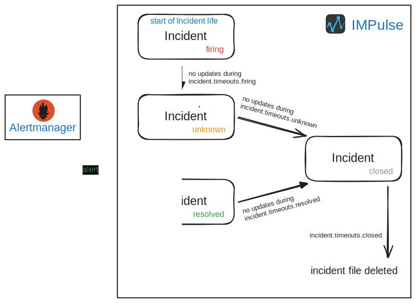
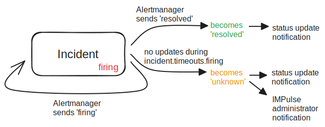
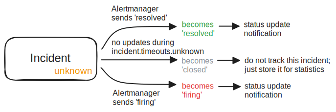
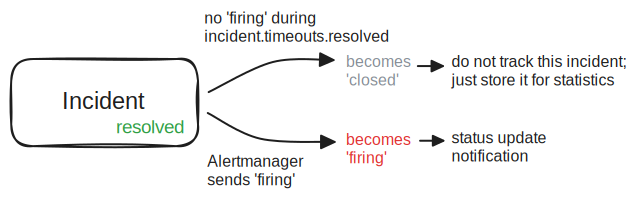
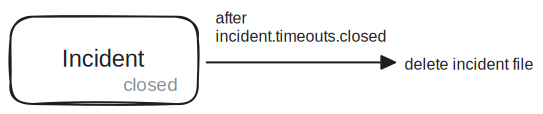

# Incident

An incident is a messege representation of an alert with its current status.

## Messages Structure

Starting from [`v1.0.0`](https://github.com/DiTsi/impulse/releases/tag/v1.0.0) incident messages have the following structure:
    
=== "Slack"

    

=== "Mattermost"

    

=== "Telegram"

    

Templates for `status icons`, `header` and `body` are [here](https://github.com/DiTsi/impulse/tree/develop/templates). See [details](templates.md).

## Statuses and their colors

Unlike Alertmanager alerts, IMPulse Incidents can have four statuses:

- firing
- resolved
- unknown
- closed

Incidents can also be temporarily frozen. This is a pseudo-status that hides the actual status and pauses further incident handling.

### firing and resolved

 

Incident status changes to **firing** and **resolved** based on Alertmanager's alert statuses received by IMPulse.

### unknown

IMPulse introduces an additional status called **unknown** to indicate that the current status of the incident may be outdated.

Alertmanager uses `repeat_interval` and `group_interval`to periodically resend the current alert status, even if it hasn't changed.

IMPulse has a setting [`incident.timeouts.firing`](../config_file.md) which defines how long it should wait for an update from Alertmanager.
For this you should set Alertmanager's `repeat_interval` + `group_interval` a little bit more than [`incident.timeouts.firing`](../config_file.md).

If an Incident status isn't updated within `incident.timeouts.firing` it switches to non-actual status named **unknown**.

Possible causes of **unknown** status:

- IMPulse did not receive an updated alert status. Possible causes:
    - the alert was silenced
    - inhibited rules configured in Alertmanager were triggered ([fix it](../alertmanager.md#inhibition))
    - IMPulse or Alertmanager was down
    - network issues
- `repeat_interval` + `group_interval` exceeds IMPulse's `incident.timeouts.firing`

When an incident becomes **unknown** , IMPulse sends a warning message to `messenger.admin_users`.

### closed

The **closed** status means the incident is closed and retained only for history and statistics. The retention period for a closed incident file is configured via `incident.timeouts.closed`. You can see closed incidents in the UI by clicking the [archive button](ui.md#elements).

There are two ways an Incident can be closed:
- a **resolved** incident remains in that status for the duration of`incident.timeouts.resolved`
- an **unknown** incident remains in that status for the duration of `incident.timeouts.unknown`

### frozen

The **frozen** state is a **pseudo-status** that temporarily pauses incident handling and suppresses status update. When an incident is frozen, its actual status (firing, resolved, unknown, or closed) is hidden but preserved underneath. Also, while the incident is frozen, no new incident with the same identifier will be created.

An incident can be frozen by clicking the [Freeze](buttons.md#freeze) button and selecting a duration.

## Lifecycle

IMPulse creates an Incident with the **firing** status and tracks it until the incident is deleted (after [`incident.timeouts.closed`](#closed)).

Here is a visualization of the full incident lifecycle:

Or individually by status:

