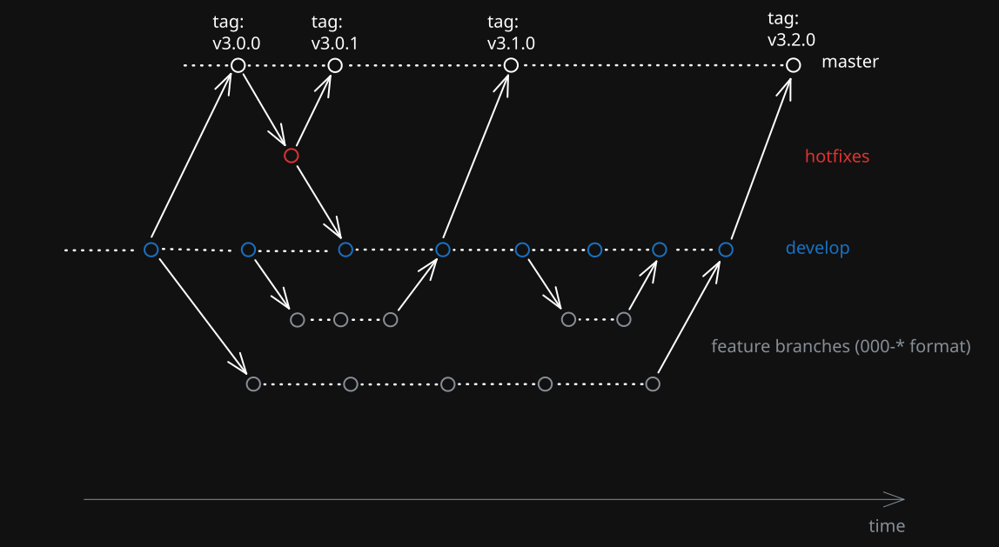

# Branching

`develop` is the main development branch. 

Feature branches are always created from `develop`. 

The `master` branch is updated only through merge requests from `develop` or via dedicated `hotfix` branches for critical fixes.

