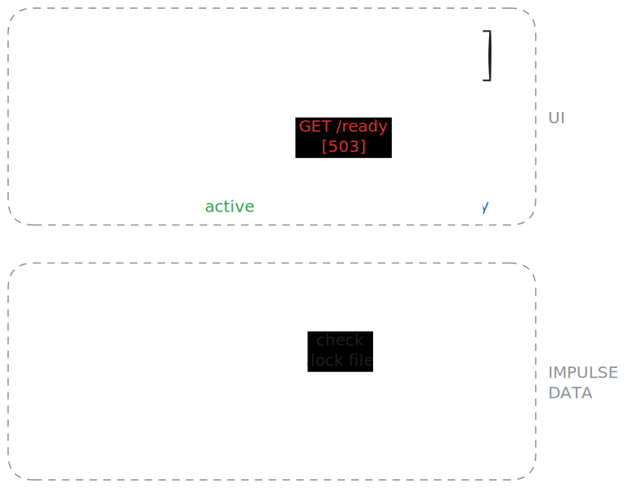

# High Availability

## Two instances

IMPulse allows running multiple instances to ensure high availability.

The first IMPulse instance creates a `.lock` file in the [DATA_PATH](envs.md) directory to lock file operations. Other instances start in `standby` mode and wait until the first instance is shut down or becomes unavailable.

Check the `/ready` endpoint to get the instance state. It responds with `200` if the instance is ready and `active`, and 503 if the instance is in `standby`.

When running multiple IMPulse instances, configure your proxy (Nginx or another) to use the `/ready` endpoint for readiness checks, routing traffic only to active instances. See [API](api.md) for endpoint details.

## Read-only filesystem

If the filesystem of the server where IMPulse is running becomes full, IMPulse will continue working. Data won't be lost as long as IMPulse continues running.

!!! danger "Danger"
    Do not stop or restart it

`ERROR` log messages about the issue will be produced.

This mechanism doesn't solve the problem, but protects from its consequences for some time.

To avoid such problems, configure monitoring for the server where IMPulse is running.
